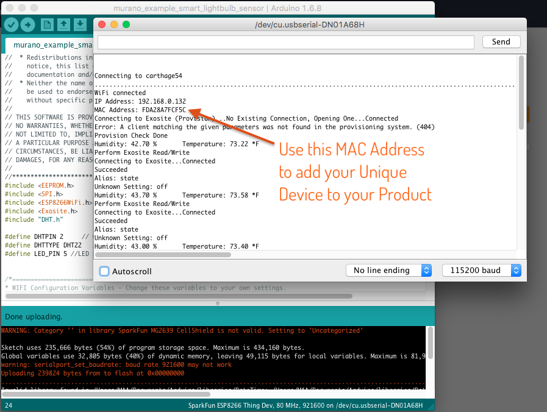

# Exosite Murano Example - ESP8266 Thing Dev Board as WiFi Smart Lightbulb

This example walks through setting up a ESP8266 Thing Dev Board to act as a Smart Lightbulb
with Murano.  Users can feel free to customize after walking through this guide as you'll have
created a full Product instance that supports a deployment of devices specific to that Product.
Product definition can be updated and more devices can be added.  After walking through these steps,
users will be interacting with live device data using a prototype developer dashboard tool.  
After this, users can go through the Murano Solution examples to deploy a Example consumer web application
that works with this product demo.

## Hardware Setup

###Hardware
* [Sparkfun ESP8266 Thing - Dev Board](https://www.sparkfun.com/products/13711)
* [Humidity and Temperature Sensor - RHT03 ](https://www.sparkfun.com/products/10167)
* 1 10K Ohm Resistors (for digital pin pull-up)
* 1 330 Ohm Resistor
* 1 LED (suggest green or yellow)
* Micro-USB B Cable

###Hook-up Guide

## Software Setup
### Setup Arduino IDE and Libraries
0. Install Arduino [arduino.cc](https://www.arduino.cc/en/Main/Software)
1. Install ESP8266 Thing Dev Board support using Arduino Board Manager - [ESP8266 Thing Dev Board Install Directions ](https://learn.sparkfun.com/tutorials/esp8266-thing-hookup-guide/installing-the-esp8266-arduino-addon)
2. Install Exosite Arduino Library - Use Arduino Library Manager, search for `Exosite` [Exosite Arduino Library Details](https://github.com/exosite-garage/arduino_exosite_library)
3. Install [Adafruit DHT Library](https://github.com/adafruit/DHT-sensor-library) - You can use Arduino Library Manager, search for `Adafruit DHT unified`

### Set-up Murano Product
1. Create a Product
  
  

  After creating a product, devices need two pieces of information to activate with the platform.  These are the Product ID when you create your product and a unique identifier serial number.  The Product ID can be found on the `Info` tab on the Product page.

  

  The Unique Identifier or Serial Number is device firmware specific.  In this situation, the Exosite Arduino library uses the device's pre-programmed MAC Address.  You'll need to get this from the debug serial output when you run the Arduino example code in a moment.

2. Set up the Product Definition
   If you did not use a template when creating the Product, go to the Definition Tab and set up your dataport resources as specified here.
   * alias: __temperature__, format: __float__
   * alias: __humidity__, format: __float__
   * alias: __uptime__, format: __integer__
   * alias: __state__, format: __integer__

   

 3. Set the default value for `state` to 0 so the device has a default value it reads to know to turn on or off the LED. Click on the `state` resource in the Definition tab and write a 0 to the value.

   

   _Note: We do not yet have the device's MAC address, so wait on adding the device._

### Create and Run the example application
1. Create a new Arduino Sketch.
2. Copy this examples .ino file's `raw` content into new Arduino Sketch
5. Edit WiFi configuration parameters for your local WiFi network (SSID and Password)
6. Edit Exosite Product ID from Murano
   
7. Make sure board is connected and select the correct Port.
   
8. Select the correct board
   
9. Compile, Download
8. Run Serial Debugger
9. Copy Device Identifier (MAC Address)
   

### Add Device to Murano Product
1. Add Device to Product in Murano using the Device Identifier
  
  
2. Verify Device Provisions using the Arduino Serial Output.  You may need to restart
if previously used and may have a old CIK (private device API key) stored in it's non-volatile memory (EEPROM).
   
3. View Device Resources (click on device)
   

### Run the Product Dashboard Developer Tool
1. On the Device page, click the 'Dashboard' tab - which is a link to the Murano Product Dashboard Developer Tool.  This opens a new browser tab.  
   
   
2. Add a pane, then add a widget to the pane.
  
3. Interact with live data
  
4. Done!
